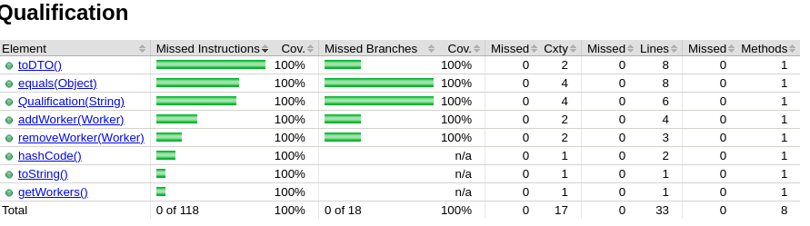
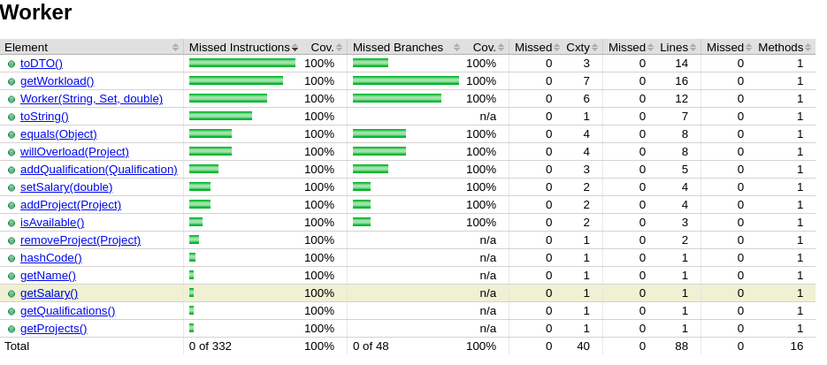

# P1 Coverage Report
This file should contain a coverage report showing in tabular format, the method, statement, and branch coverages for each method in the classes Project, Worker, and Qualification. Remember to reflect on this table. 

## Project Class

## Qualification Class

## Worker Class

### Reflection
We were successfully able to get 100% statement and branch coverage on the Project, Qualification, and Worker classes. We found that before implementing our ISP table, we were able to effectively write tests that provided statement coverage on our methods. However, we needed the ISP table to effectively construct tests that covered all of our branches. In addition to writing new tests that covered different branches, we often found that certain if statements were unecessary. These unecessary if statements were able to be deleted, which got rid of possible branches and increased our branch coverage as well. Overall, the task of writing effective tests that covered all statements and branches would have been a lot more difficult without the ISP table serving as a guide.