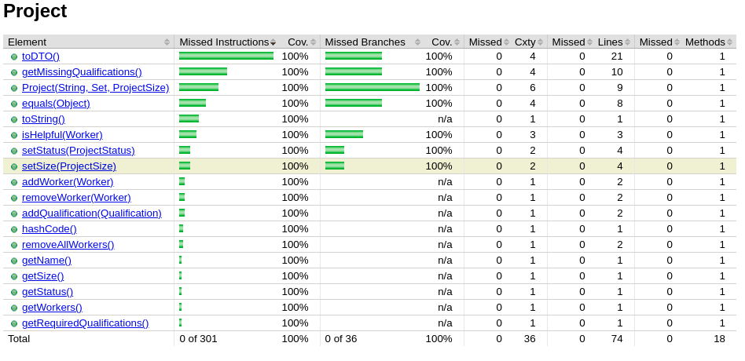
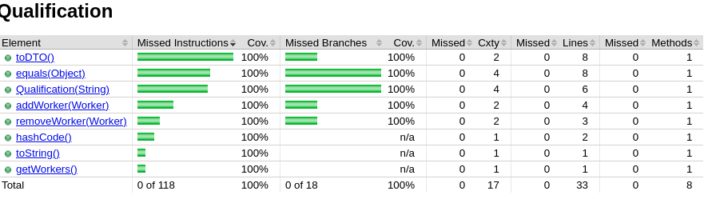

# P2 Coverage Report
The workflow CI will produce coverage information, so the graders will get the report from there. However, you should also collect the coverage information and reflect on it in your coverage report. You will also use this information to improve the test suite to get a higher statemernt and branch coverage.

Create a file reports/P2_coverage.md in your repository. It should contain a coverage report showing in tabular format, the method, statement, and branch coverages for each method in the classes Company, Project, Worker, and Qualification. Remember to reflect on this table and lists tests you added to improve coverage. 

## Project Class

## Qualification Class

## Worker Class

### Reflection
Like P1, we were successfully able to get 100% statement and branch coverage on the Company class. This is in addition to the 100% we had for the Qualification, Worker, and Project classes as well. The Company class introduced more unique faults that the previously implmented classes. The ISP table was again the most important tool in writing good tests. Considering what variables a method is manipulating is great for writing correct tests. The base choice table was a new tool to formulate the tests. The main advantage of the base choice table was more careful consideration of what inputs were being given to the different objects, and creating inputs that more effectively mixed and matched inputs. The next tool introduced in this sprint was mutation testing. The program PIT introduces mutants into the code to see if our tests effectively found and killed the mutants. This concept is great for evaluating the efficacy of the tests that were written. Unit tests, ISP tables, base choice tables, and mutation testing are useful concepts that work towards the goal of more reliable and fault averse software.