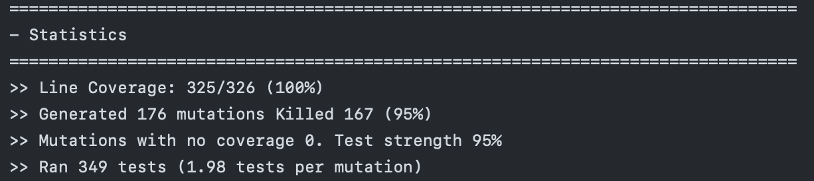
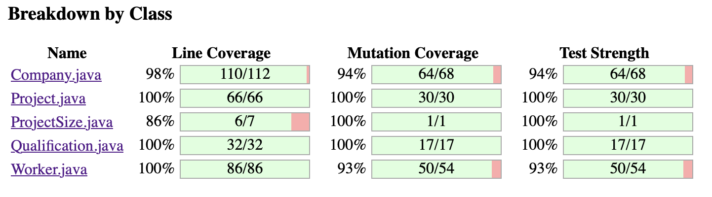

# P2 Mutation Score Report
This file should contain a coverage report showing in a tabular format, the mutation scores for the classes Company, Project, Worker, and Qualification. Remember to reflect on this table and lists tests you added to improve mutation scores.

## Mutation Score

## Class Breakdown

## Reflection
Coming out of the first sprint we had very thorough test coverage that gave us an already high mutation score. We continued our practices of utilizing input space partitioning to drive the directions of our tests, rather than working backwards from Mutation testing itself, and found that we didn't have much to address based on our mutation score alone. By the end of the sprint the result of our rigorous test driven development was a mutation score of 95% which we felt was sufficient.
