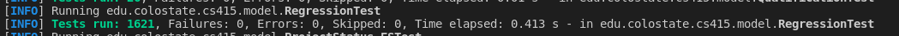

## Randoop Tests Added and Passes Tests
### Generated Tests

### Passed Tests

## Evosuite Generated Tests

boise:~/cs415/t18/server$ java -jar tools/evosuite-1.0.6.jar -prefix edu.colostate.cs415.model -projectCP target/classes
* EvoSuite 1.0.6
* Analyzing classpath (generating inheritance tree)
  - target/classes
* Found 6 matching classes for prefix edu.colostate.cs415.model
* Current class: edu.colostate.cs415.model.Worker
* Going to generate test cases for class: edu.colostate.cs415.model.Worker
* Starting client
* Connecting to master process on port 18016
* Analyzing classpath: 
* Inheritance tree loaded from /tmp/ES_inheritancetree626584271752082049.xml.gz
* Finished analyzing classpath
* Generating tests for class edu.colostate.cs415.model.Worker
* Test criteria:
  - Line Coverage
  - Branch Coverage
  - Exception
  - Mutation testing (weak)
  - Method-Output Coverage
  - Top-Level Method Coverage
  - No-Exception Top-Level Method Coverage
  - Context Branch Coverage
* Setting up search algorithm for whole suite generation
* Total number of test goals: 
  - Line 88
  - Branch 63
  - Exception 0
  - MutationFactory 190
  - Output 37
  - Method 16
  - MethodNoException 16
  - CBranchFitnessFactory 63
* Using seed 1679860979560
* Starting evolution
[Progress:=========>                    33%] [Cov:================================>  92%][MASTER] 14:03:20.176 [logback-2] ERROR TestCluster - Failed to check cache for java.util.function.Predicate<T> : Type points to itself
[Progress:==============================100%] [Cov:=================================> 95%]
* Search finished after 61s and 1115 generations, 365040 statements, best individual has fitness: 20.944444444444446
* Minimizing test suite
* Going to analyze the coverage criteria
* Coverage analysis for criterion LINE
* Coverage of criterion LINE: 99%
* Total number of goals: 88
* Number of covered goals: 87
* Coverage analysis for criterion BRANCH
* Coverage of criterion BRANCH: 98%
* Total number of goals: 63
* Number of covered goals: 62
* Coverage analysis for criterion EXCEPTION
* Coverage of criterion EXCEPTION: 100%
* Total number of goals: 8
* Number of covered goals: 8
* Coverage analysis for criterion WEAKMUTATION
* Coverage of criterion WEAKMUTATION: 96%
* Total number of goals: 190
* Number of covered goals: 183
* Coverage analysis for criterion OUTPUT
* Coverage of criterion OUTPUT: 65%
* Total number of goals: 37
* Number of covered goals: 24
* Coverage analysis for criterion METHOD
* Coverage of criterion METHOD: 100%
* Total number of goals: 16
* Number of covered goals: 16
* Coverage analysis for criterion METHODNOEXCEPTION
* Coverage of criterion METHODNOEXCEPTION: 100%
* Total number of goals: 16
* Number of covered goals: 16
* Coverage analysis for criterion CBRANCH
* Coverage of criterion CBRANCH: 98%
* Total number of goals: 63
* Number of covered goals: 62
* Generated 44 tests with total length 281
* Resulting test suite's coverage: 95% (average coverage for all fitness functions)
* Generating assertions
* Resulting test suite's mutation score: 75%
* Compiling and checking tests
[MASTER] 14:04:06.083 [logback-1] WARN  JUnitAnalyzer - Found unstable test named test0 -> class java.lang.NullPointerException: null
[MASTER] 14:04:06.083 [logback-1] WARN  JUnitAnalyzer - Failing test:
 LinkedHashSet<Qualification> linkedHashSet0 = new LinkedHashSet<Qualification>(1287, 1.0F);
Qualification qualification0 = new Qualification("{.");
linkedHashSet0.add(qualification0);
Worker worker0 = new Worker("]D[}d0awCOq;1X]oD1N", linkedHashSet0, 1287);
ProjectSize projectSize0 = ProjectSize.BIG;
Project project0 = new Project("]D[}d0awCOq;1X]oD1N:0:2:0", linkedHashSet0, projectSize0);
worker0.addProject(project0);
worker0.willOverload((Project) null);

* Writing JUnit test case 'Worker_ESTest' to evosuite-tests
* Done!

* Computation finished
* Current class: edu.colostate.cs415.model.Project
* Going to generate test cases for class: edu.colostate.cs415.model.Project
* Starting client
* Connecting to master process on port 19605
* Analyzing classpath: 
* Inheritance tree loaded from /tmp/ES_inheritancetree626584271752082049.xml.gz
* Finished analyzing classpath
* Generating tests for class edu.colostate.cs415.model.Project
* Test criteria:
  - Line Coverage
  - Branch Coverage
  - Exception
  - Mutation testing (weak)
  - Method-Output Coverage
  - Top-Level Method Coverage
  - No-Exception Top-Level Method Coverage
  - Context Branch Coverage
* Setting up search algorithm for whole suite generation
* Total number of test goals: 
  - Line 72
  - Branch 46
  - Exception 0
  - MutationFactory 50
  - Output 36
  - Method 17
  - MethodNoException 17
  - CBranchFitnessFactory 46
* Using seed 1679861047455
* Starting evolution
[Progress:>                             0%] [Cov:==========>                        31%][MASTER] 14:04:08.377 [logback-2] ERROR TestCluster - Failed to check cache for java.util.function.Predicate<T> : Type points to itself
[Progress:=============================>98%] [Cov:=================================> 95%][MASTER] 14:05:07.689 [logback-2] ERROR TestCluster - Failed to check cache for java.util.function.Function<T, R> : Type points to itself
[Progress:==============================100%] [Cov:=================================> 95%]
* Search finished after 62s and 2254 generations, 513798 statements, best individual has fitness: 15.125
* Minimizing test suite
* Going to analyze the coverage criteria
* Coverage analysis for criterion LINE
* Coverage of criterion LINE: 100%
* Total number of goals: 72
* Number of covered goals: 72
* Coverage analysis for criterion BRANCH
* Coverage of criterion BRANCH: 100%
* Total number of goals: 46
* Number of covered goals: 46
* Coverage analysis for criterion EXCEPTION
* Coverage of criterion EXCEPTION: 100%
* Total number of goals: 7
* Number of covered goals: 7
* Coverage analysis for criterion WEAKMUTATION
* Coverage of criterion WEAKMUTATION: 100%
* Total number of goals: 50
* Number of covered goals: 50
* Coverage analysis for criterion OUTPUT
* Coverage of criterion OUTPUT: 58%
* Total number of goals: 36
* Number of covered goals: 21
* Coverage analysis for criterion METHOD
* Coverage of criterion METHOD: 100%
* Total number of goals: 17
* Number of covered goals: 17
* Coverage analysis for criterion METHODNOEXCEPTION
* Coverage of criterion METHODNOEXCEPTION: 100%
* Total number of goals: 17
* Number of covered goals: 17
* Coverage analysis for criterion CBRANCH
* Coverage of criterion CBRANCH: 100%
* Total number of goals: 46
* Number of covered goals: 46
* Generated 31 tests with total length 150
* Resulting test suite's coverage: 95% (average coverage for all fitness functions)
* Generating assertions
* Resulting test suite's mutation score: 76%
* Compiling and checking tests
* Writing JUnit test case 'Project_ESTest' to evosuite-tests
* Done!

* Computation finished
* Current class: edu.colostate.cs415.model.ProjectStatus
* Going to generate test cases for class: edu.colostate.cs415.model.ProjectStatus
* Starting client
* Connecting to master process on port 14516
* Analyzing classpath: 
* Inheritance tree loaded from /tmp/ES_inheritancetree626584271752082049.xml.gz
* Finished analyzing classpath
* Generating tests for class edu.colostate.cs415.model.ProjectStatus
* Test criteria:
  - Line Coverage
  - Branch Coverage
  - Exception
  - Mutation testing (weak)
  - Method-Output Coverage
  - Top-Level Method Coverage
  - No-Exception Top-Level Method Coverage
  - Context Branch Coverage
* Setting up search algorithm for whole suite generation
* Total number of test goals: 
  - Line 0
  - Branch 0
  - Exception 0
  - MutationFactory 0
  - Output 0
  - Method 0
  - MethodNoException 0
  - CBranchFitnessFactory 0
* Using seed 1679861112183
* Starting evolution
[Progress:>                             0%] [Cov:===================================100%]
* Search finished after 0s and 0 generations, 591 statements, best individual has fitness: 1.0
* Minimizing test suite
* Going to analyze the coverage criteria
* Coverage analysis for criterion LINE
* Coverage of criterion LINE: 100% (no goals)
* Coverage analysis for criterion BRANCH
* Coverage of criterion BRANCH: 100% (no goals)
* Coverage analysis for criterion EXCEPTION
* Coverage of criterion EXCEPTION: 100% (no goals)
* Coverage analysis for criterion WEAKMUTATION
* Coverage of criterion WEAKMUTATION: 100% (no goals)
* Coverage analysis for criterion OUTPUT
* Coverage of criterion OUTPUT: 100% (no goals)
* Coverage analysis for criterion METHOD
* Coverage of criterion METHOD: 100% (no goals)
* Coverage analysis for criterion METHODNOEXCEPTION
* Coverage of criterion METHODNOEXCEPTION: 100% (no goals)
* Coverage analysis for criterion CBRANCH
* Coverage of criterion CBRANCH: 100% (no goals)
* Generated 0 tests with total length 0
* Resulting test suite's coverage: 100% (average coverage for all fitness functions)
* Generating assertions
* Resulting test suite's mutation score: 100%
* Compiling and checking tests
* Writing JUnit test case 'ProjectStatus_ESTest' to evosuite-tests
* Done!

* Computation finished
* Current class: edu.colostate.cs415.model.Qualification
* Going to generate test cases for class: edu.colostate.cs415.model.Qualification
* Starting client
* Connecting to master process on port 10071
* Analyzing classpath: 
* Inheritance tree loaded from /tmp/ES_inheritancetree626584271752082049.xml.gz
* Finished analyzing classpath
* Generating tests for class edu.colostate.cs415.model.Qualification
* Test criteria:
  - Line Coverage
  - Branch Coverage
  - Exception
  - Mutation testing (weak)
  - Method-Output Coverage
  - Top-Level Method Coverage
  - No-Exception Top-Level Method Coverage
  - Context Branch Coverage
* Setting up search algorithm for whole suite generation
* Total number of test goals: 
  - Line 33
  - Branch 21
  - Exception 0
  - MutationFactory 18
  - Output 13
  - Method 8
  - MethodNoException 8
  - CBranchFitnessFactory 21
* Using seed 1679861113276
[Progress:>                             0%] [Cov:>                                  0%]* Starting evolution
[Progress:=>                            5%] [Cov:================================>  94%][MASTER] 14:05:17.369 [logback-2] ERROR TestCluster - Failed to check cache for java.util.function.Predicate<T> : Type points to itself
[Progress:==============================100%] [Cov:=================================> 95%]
* Search finished after 61s and 3650 generations, 546456 statements, best individual has fitness: 5.25
* Minimizing test suite
* Going to analyze the coverage criteria
* Coverage analysis for criterion LINE
* Coverage of criterion LINE: 100%
* Total number of goals: 33
* Number of covered goals: 33
* Coverage analysis for criterion BRANCH
* Coverage of criterion BRANCH: 100%
* Total number of goals: 21
* Number of covered goals: 21
* Coverage analysis for criterion EXCEPTION
* Coverage of criterion EXCEPTION: 100%
* Total number of goals: 3
* Number of covered goals: 3
* Coverage analysis for criterion WEAKMUTATION
* Coverage of criterion WEAKMUTATION: 100%
* Total number of goals: 18
* Number of covered goals: 18
* Coverage analysis for criterion OUTPUT
* Coverage of criterion OUTPUT: 62%
* Total number of goals: 13
* Number of covered goals: 8
* Coverage analysis for criterion METHOD
* Coverage of criterion METHOD: 100%
* Total number of goals: 8
* Number of covered goals: 8
* Coverage analysis for criterion METHODNOEXCEPTION
* Coverage of criterion METHODNOEXCEPTION: 100%
* Total number of goals: 8
* Number of covered goals: 8
* Coverage analysis for criterion CBRANCH
* Coverage of criterion CBRANCH: 100%
* Total number of goals: 21
* Number of covered goals: 21
* Generated 15 tests with total length 40
* Resulting test suite's coverage: 95% (average coverage for all fitness functions)
* Generating assertions
* Resulting test suite's mutation score: 54%
* Compiling and checking tests
* Writing JUnit test case 'Qualification_ESTest' to evosuite-tests
* Done!

* Computation finished
* Current class: edu.colostate.cs415.model.Company
* Going to generate test cases for class: edu.colostate.cs415.model.Company
* Starting client
* Connecting to master process on port 19200
* Analyzing classpath: 
* Inheritance tree loaded from /tmp/ES_inheritancetree626584271752082049.xml.gz
* Finished analyzing classpath
* Generating tests for class edu.colostate.cs415.model.Company
* Test criteria:
  - Line Coverage
  - Branch Coverage
  - Exception
  - Mutation testing (weak)
  - Method-Output Coverage
  - Top-Level Method Coverage
  - No-Exception Top-Level Method Coverage
  - Context Branch Coverage
* Setting up search algorithm for whole suite generation
* Total number of test goals: 
  - Line 131
  - Branch 149
  - Exception 0
  - MutationFactory 145
  - Output 58
  - Method 20
  - MethodNoException 20
  - CBranchFitnessFactory 149
* Using seed 1679861176803
* Starting evolution
[Progress:===>                          10%] [Cov:=============================>     85%][MASTER] 14:06:23.919 [logback-2] ERROR TestCluster - Failed to check cache for java.util.function.Predicate<T> : Type points to itself
[Progress:==============================100%] [Cov:===============================>   90%]
* Search finished after 61s and 489 generations, 208592 statements, best individual has fitness: 72.17424242144845
* Minimizing test suite
* Going to analyze the coverage criteria
* Coverage analysis for criterion LINE
* Coverage of criterion LINE: 98%
* Total number of goals: 131
* Number of covered goals: 128
* Coverage analysis for criterion BRANCH
* Coverage of criterion BRANCH: 95%
* Total number of goals: 149
* Number of covered goals: 142
* Coverage analysis for criterion EXCEPTION
* Coverage of criterion EXCEPTION: 100%
* Total number of goals: 10
* Number of covered goals: 10
* Coverage analysis for criterion WEAKMUTATION
* Coverage of criterion WEAKMUTATION: 87%
* Total number of goals: 145
* Number of covered goals: 126
* Coverage analysis for criterion OUTPUT
* Coverage of criterion OUTPUT: 60%
* Total number of goals: 58
* Number of covered goals: 35
* Coverage analysis for criterion METHOD
* Coverage of criterion METHOD: 100%
* Total number of goals: 20
* Number of covered goals: 20
* Coverage analysis for criterion METHODNOEXCEPTION
* Coverage of criterion METHODNOEXCEPTION: 100%
* Total number of goals: 20
* Number of covered goals: 20
* Coverage analysis for criterion CBRANCH
* Coverage of criterion CBRANCH: 92%
* Total number of goals: 149
* Number of covered goals: 137
* Generated 55 tests with total length 275
* Resulting test suite's coverage: 91% (average coverage for all fitness functions)
* Generating assertions
* Resulting test suite's mutation score: 60%
* Compiling and checking tests
* Writing JUnit test case 'Company_ESTest' to evosuite-tests
* Done!

* Computation finished
* Current class: edu.colostate.cs415.model.ProjectSize
* Going to generate test cases for class: edu.colostate.cs415.model.ProjectSize
* Starting client
* Connecting to master process on port 20041
* Analyzing classpath: 
* Inheritance tree loaded from /tmp/ES_inheritancetree626584271752082049.xml.gz
* Finished analyzing classpath
* Generating tests for class edu.colostate.cs415.model.ProjectSize
* Test criteria:
  - Line Coverage
  - Branch Coverage
  - Exception
  - Mutation testing (weak)
  - Method-Output Coverage
  - Top-Level Method Coverage
  - No-Exception Top-Level Method Coverage
  - Context Branch Coverage
* Setting up search algorithm for whole suite generation
* Total number of test goals: 
  - Line 4
  - Branch 1
  - Exception 0
  - MutationFactory 3
  - Output 10
  - Method 1
  - MethodNoException 1
  - CBranchFitnessFactory 1
[Progress:>                             0%] [Cov:>                                  0%]* Using seed 1679861245716
* Starting evolution
[Progress:==============================100%] [Cov:=============================>     83%]
* Search finished after 61s and 10146 generations, 681050 statements, best individual has fitness: 8.75
* Minimizing test suite
* Going to analyze the coverage criteria
* Coverage analysis for criterion LINE
* Coverage of criterion LINE: 25%
* Total number of goals: 4
* Number of covered goals: 1
* Coverage analysis for criterion BRANCH
* Coverage of criterion BRANCH: 100%
* Total number of goals: 1
* Number of covered goals: 1
* Coverage analysis for criterion EXCEPTION
* Coverage of criterion EXCEPTION: 100% (no goals)
* Coverage analysis for criterion WEAKMUTATION
* Coverage of criterion WEAKMUTATION: 100%
* Total number of goals: 3
* Number of covered goals: 3
* Coverage analysis for criterion OUTPUT
* Coverage of criterion OUTPUT: 30%
* Total number of goals: 10
* Number of covered goals: 3
* Coverage analysis for criterion METHOD
* Coverage of criterion METHOD: 100%
* Total number of goals: 1
* Number of covered goals: 1
* Coverage analysis for criterion METHODNOEXCEPTION
* Coverage of criterion METHODNOEXCEPTION: 100%
* Total number of goals: 1
* Number of covered goals: 1
* Coverage analysis for criterion CBRANCH
* Coverage of criterion CBRANCH: 100%
* Total number of goals: 1
* Number of covered goals: 1
* Generated 3 tests with total length 4
* Resulting test suite's coverage: 82% (average coverage for all fitness functions)
* Generating assertions
* Resulting test suite's mutation score: 50%
* Compiling and checking tests
* Writing JUnit test case 'ProjectSize_ESTest' to evosuite-tests
* Done!

* Computation finished

## Running Generated Tests

boise:~/cs415/t18/server$ mvn clean test
[INFO] Scanning for projects...

[INFO] 

[INFO] ---------------< edu.colostate.cs415:company_management >---------------

[INFO] Building company_management 1.0-SNAPSHOT

[INFO] --------------------------------[ jar ]---------------------------------

[INFO] 

[INFO] --- maven-clean-plugin:3.1.0:clean (default-clean) @ company_management ---

[INFO] Deleting /s/bach/n/under/carnhy/cs415/t18/server/target

[INFO] 

[INFO] --- jacoco-maven-plugin:0.8.8:prepare-agent (default) @ company_management ---

[INFO] argLine set to -javaagent:/s/bach/n/under/carnhy/.m2/repository/org/jacoco/org.jacoco.agent/0.8.8/org.jacoco.agent-0.8.8-runtime.jar=destfile=/s/bach/n/under/carnhy/cs415/t18/server/target/jacoco.exec

[INFO] 

[INFO] --- maven-resources-plugin:3.0.2:resources (default-resources) @ company_management ---

[INFO] Using 'UTF-8' encoding to copy filtered resources.

[INFO] skip non existing resourceDirectory /s/bach/n/under/carnhy/cs415/t18/server/src/main/resources

[INFO] 

[INFO] --- maven-compiler-plugin:3.8.0:compile (default-compile) @ company_management ---

[INFO] Changes detected - recompiling the module!

[INFO] Compiling 13 source files to /s/bach/n/under/carnhy/cs415/t18/server/target/classes

[INFO] 

[INFO] --- maven-resources-plugin:3.0.2:testResources (default-testResources) @ company_management ---

[INFO] Using 'UTF-8' encoding to copy filtered resources.

[INFO] skip non existing resourceDirectory /s/bach/n/under/carnhy/cs415/t18/server/src/test/resources

[INFO] 

[INFO] --- maven-compiler-plugin:3.8.0:testCompile (default-testCompile) @ company_management ---

[INFO] Changes detected - recompiling the module!

[INFO] Compiling 17 source files to /s/bach/n/under/carnhy/cs415/t18/server/target/test-classes

[INFO] 

[INFO] --- ekstazi-maven-plugin:5.3.0:select (ekstazi) @ company_management ---

[INFO] 

[INFO] --- maven-surefire-plugin:2.22.1:test (default-test) @ company_management ---

[INFO] 

[INFO] -------------------------------------------------------

[INFO]  T E S T S

[INFO] -------------------------------------------------------

[INFO] Running edu.colostate.cs415.model.ProjectSize_ESTest

14:20:12.472 [main] INFO  o.e.r.instrumentation.EvoClassLoader - Seeing class for first time: edu.colostate.cs415.model.ProjectSize_ESTest

14:20:12.475 [main] INFO  o.e.r.instrumentation.EvoClassLoader - Instrumenting class 'edu.colostate.cs415.model.ProjectSize_ESTest'.

14:20:12.510 [main] INFO  o.e.r.instrumentation.EvoClassLoader - Seeing class for first time: edu.colostate.cs415.model.ProjectSize_ESTest_scaffolding

14:20:12.510 [main] INFO  o.e.r.instrumentation.EvoClassLoader - Instrumenting class 'edu.colostate.cs415.model.ProjectSize_ESTest_scaffolding'.

14:20:12.514 [main] INFO  o.e.r.instrumentation.EvoClassLoader - Keeping class: edu.colostate.cs415.model.ProjectSize_ESTest_scaffolding

14:20:12.514 [main] INFO  o.e.r.instrumentation.EvoClassLoader - Keeping class: edu.colostate.cs415.model.ProjectSize_ESTest

14:20:12.592 [main] DEBUG o.e.runtime.sandbox.MSecurityManager - Adding privileged thread: "Reference Handler"

14:20:12.592 [main] DEBUG o.e.runtime.sandbox.MSecurityManager - Adding privileged thread: "Finalizer"

14:20:12.592 [main] DEBUG o.e.runtime.sandbox.MSecurityManager - Adding privileged thread: "Signal Dispatcher"

14:20:12.592 [main] DEBUG o.e.runtime.sandbox.MSecurityManager - Adding privileged thread: "process reaper"

14:20:12.592 [main] DEBUG o.e.runtime.sandbox.MSecurityManager - Adding privileged thread: "Java2D Disposer"

14:20:12.592 [main] DEBUG o.e.runtime.sandbox.MSecurityManager - Adding privileged thread: "main"

14:20:12.592 [main] DEBUG o.e.runtime.sandbox.MSecurityManager - Adding privileged thread: "surefire-forkedjvm-command-thread"

14:20:12.593 [main] DEBUG o.e.runtime.sandbox.MSecurityManager - Adding privileged thread: "surefire-forkedjvm-ping-30s"

14:20:12.625 [main] INFO  o.e.r.instrumentation.EvoClassLoader - Seeing class for first time: edu.colostate.cs415.model.ProjectSize

14:20:12.625 [main] INFO  o.e.r.instrumentation.EvoClassLoader - Instrumenting class 'edu.colostate.cs415.model.ProjectSize'.

14:20:12.640 [main] INFO  o.e.r.i.MethodCallReplacementClassAdapter - Adding mock interface to class edu/colostate/cs415/model/ProjectSize

14:20:12.763 [main] INFO  o.e.r.i.CreateClassResetClassAdapter - Found static initializer in class edu/colostate/cs415/model/ProjectSize

14:20:12.765 [main] INFO  o.e.r.instrumentation.EvoClassLoader - Keeping class: edu.colostate.cs415.model.ProjectSize

[INFO] Tests run: 3, Failures: 0, Errors: 0, Skipped: 0, Time elapsed: 0.482 s - in edu.colostate.cs415.model.ProjectSize_ESTest

[INFO] Running edu.colostate.cs415.model.Project_ESTest

14:20:12.854 [main] INFO  o.e.r.instrumentation.EvoClassLoader - Seeing class for first time: edu.colostate.cs415.model.Project_ESTest

14:20:12.854 [main] INFO  o.e.r.instrumentation.EvoClassLoader - Instrumenting class 'edu.colostate.cs415.model.Project_ESTest'.

14:20:12.866 [main] INFO  o.e.r.instrumentation.EvoClassLoader - Seeing class for first time: edu.colostate.cs415.model.
Project_ESTest_scaffolding

14:20:12.866 [main] INFO  o.e.r.instrumentation.EvoClassLoader - Instrumenting class 'edu.colostate.cs415.model.Project_ESTest_scaffolding'.

14:20:12.868 [main] INFO  o.e.r.instrumentation.EvoClassLoader - Keeping class: edu.colostate.cs415.model.Project_ESTest_scaffolding

14:20:12.868 [main] INFO  o.e.r.instrumentation.EvoClassLoader - Keeping class: edu.colostate.cs415.model.Project_ESTest

14:20:12.873 [main] DEBUG o.e.runtime.sandbox.MSecurityManager - Adding privileged thread: "Reference Handler"

14:20:12.873 [main] DEBUG o.e.runtime.sandbox.MSecurityManager - Adding privileged thread: "Finalizer"

14:20:12.874 [main] DEBUG o.e.runtime.sandbox.MSecurityManager - Adding privileged thread: "Signal Dispatcher"

14:20:12.874 [main] DEBUG o.e.runtime.sandbox.MSecurityManager - Adding privileged thread: "process reaper"

14:20:12.874 [main] DEBUG o.e.runtime.sandbox.MSecurityManager - Adding privileged thread: "Java2D Disposer"

14:20:12.874 [main] DEBUG o.e.runtime.sandbox.MSecurityManager - Adding privileged thread: "main"

14:20:12.874 [main] DEBUG o.e.runtime.sandbox.MSecurityManager - Adding privileged thread: "surefire-forkedjvm-command-thread"

14:20:12.874 [main] DEBUG o.e.runtime.sandbox.MSecurityManager - Adding privileged thread: "surefire-forkedjvm-ping-30s"

14:20:12.877 [main] INFO  o.e.r.instrumentation.EvoClassLoader - Seeing class for first time: edu.colostate.cs415.dto.QualificationDTO

14:20:12.877 [main] INFO  o.e.r.instrumentation.EvoClassLoader - Instrumenting class 'edu.colostate.cs415.dto.QualificationDTO'.

14:20:12.883 [main] INFO  o.e.r.i.MethodCallReplacementClassAdapter - Adding mock interface to class edu/colostate/cs415/dto/QualificationDTO

14:20:12.895 [main] INFO  o.e.r.i.CreateClassResetClassAdapter - Creating brand-new static initializer in class edu/colostate/cs415/dto/QualificationDTO

14:20:12.895 [main] INFO  o.e.r.instrumentation.EvoClassLoader - Defined package (3): package edu.colostate.cs415.dto, 410715061

14:20:12.895 [main] INFO  o.e.r.instrumentation.EvoClassLoader - Keeping class: edu.colostate.cs415.dto.QualificationDTO

14:20:12.896 [main] INFO  o.e.r.instrumentation.EvoClassLoader - Seeing class for first time: edu.colostate.cs415.dto.ProjectDTO

14:20:12.896 [main] INFO  o.e.r.instrumentation.EvoClassLoader - Instrumenting class 'edu.colostate.cs415.dto.ProjectDTO'.

14:20:12.897 [main] INFO  o.e.r.i.MethodCallReplacementClassAdapter - Adding mock interface to class edu/colostate/cs415/dto/ProjectDTO

14:20:12.903 [main] INFO  o.e.r.i.CreateClassResetClassAdapter - Creating brand-new static initializer in class edu/colostate/cs415/dto/ProjectDTO

14:20:12.903 [main] INFO  o.e.r.instrumentation.EvoClassLoader - Keeping class: edu.colostate.cs415.dto.ProjectDTO

14:20:12.904 [main] INFO  o.e.r.instrumentation.EvoClassLoader - Seeing class for first time: edu.colostate.cs415.model.Worker

14:20:12.904 [main] INFO  o.e.r.instrumentation.EvoClassLoader - Instrumenting class 'edu.colostate.cs415.model.Worker'.

14:20:12.906 [main] INFO  o.e.r.i.MethodCallReplacementClassAdapter - Adding mock interface to class edu/colostate/cs415/model/Worker

14:20:12.912 [main] INFO  o.e.r.i.CreateClassResetClassAdapter - Creating brand-new static initializer in class edu/colostate/cs415/model/Worker

14:20:12.912 [main] INFO  o.e.r.i.CreateClassResetClassAdapter - Adding bytecode for initializing field MAX_WORKLOAD

14:20:12.915 [main] INFO  o.e.r.instrumentation.EvoClassLoader - Keeping class: edu.colostate.cs415.model.Worker

14:20:12.915 [main] INFO  o.e.r.instrumentation.EvoClassLoader - Seeing class for first time: edu.colostate.cs415.dto.WorkerDTO

14:20:12.916 [main] INFO  o.e.r.instrumentation.EvoClassLoader - Instrumenting class 'edu.colostate.cs415.dto.WorkerDTO'.

14:20:12.917 [main] INFO  o.e.r.i.MethodCallReplacementClassAdapter - Adding mock interface to class edu/colostate/cs415/dto/WorkerDTO

14:20:12.918 [main] INFO  o.e.r.i.CreateClassResetClassAdapter - Creating brand-new static initializer in class edu/colostate/cs415/dto/WorkerDTO

14:20:12.919 [main] INFO  o.e.r.instrumentation.EvoClassLoader - Keeping class: edu.colostate.cs415.dto.WorkerDTO

14:20:12.920 [main] INFO  o.e.r.instrumentation.EvoClassLoader - Seeing class for first time: edu.colostate.cs415.model.Project

14:20:12.920 [main] INFO  o.e.r.instrumentation.EvoClassLoader - Instrumenting class 'edu.colostate.cs415.model.Project'.

14:20:12.923 [main] INFO  o.e.r.i.MethodCallReplacementClassAdapter - Adding mock interface to class edu/colostate/cs415/model/Project

14:20:12.927 [main] INFO  o.e.r.i.CreateClassResetClassAdapter - Creating brand-new static initializer in class edu/colostate/cs415/model/Project

14:20:12.928 [main] INFO  o.e.r.instrumentation.EvoClassLoader - Keeping class: edu.colostate.cs415.model.Project

14:20:12.928 [main] INFO  o.e.r.instrumentation.EvoClassLoader - Seeing class for first time: edu.colostate.cs415.model.Qualification

14:20:12.928 [main] INFO  o.e.r.instrumentation.EvoClassLoader - Instrumenting class 'edu.colostate.cs415.model.Qualification'.

14:20:12.930 [main] INFO  o.e.r.i.MethodCallReplacementClassAdapter - Adding mock interface to class edu/colostate/cs415/model/Qualification

14:20:12.932 [main] INFO  o.e.r.i.CreateClassResetClassAdapter - Creating brand-new static initializer in class edu/colostate/cs415/model/Qualification

14:20:12.932 [main] INFO  o.e.r.instrumentation.EvoClassLoader - Keeping class: edu.colostate.cs415.model.Qualification

14:20:12.933 [main] INFO  o.e.r.instrumentation.EvoClassLoader - Seeing class for first time: edu.colostate.cs415.model.ProjectStatus

14:20:12.933 [main] INFO  o.e.r.instrumentation.EvoClassLoader - Instrumenting class 'edu.colostate.cs415.model.ProjectStatus'.

14:20:12.934 [main] INFO  o.e.r.i.MethodCallReplacementClassAdapter - Adding mock interface to class edu/colostate/cs415/model/ProjectStatus

14:20:12.935 [main] INFO  o.e.r.i.CreateClassResetClassAdapter - Found static initializer in class edu/colostate/cs415/model/ProjectStatus

14:20:12.936 [main] INFO  o.e.r.instrumentation.EvoClassLoader - Keeping class: edu.colostate.cs415.model.ProjectStatus

14:20:12.937 [main] INFO  o.e.r.instrumentation.EvoClassLoader - Seeing class for first time: edu.colostate.cs415.model.ProjectSize

14:20:12.937 [main] INFO  o.e.r.instrumentation.EvoClassLoader - Instrumenting class 'edu.colostate.cs415.model.ProjectSize'.

14:20:12.938 [main] INFO  o.e.r.i.MethodCallReplacementClassAdapter - Adding mock interface to class edu/colostate/cs415/model/ProjectSize

14:20:12.938 [main] INFO  o.e.r.i.CreateClassResetClassAdapter - Found static initializer in class edu/colostate/cs415/model/ProjectSize

14:20:12.939 [main] INFO  o.e.r.instrumentation.EvoClassLoader - Keeping class: edu.colostate.cs415.model.ProjectSize

[INFO] Tests run: 31, Failures: 0, Errors: 0, Skipped: 0, Time elapsed: 0.117 s - in edu.colostate.cs415.model.Project_ESTest

[INFO] Running edu.colostate.cs415.model.Worker_ESTest

14:20:12.988 [main] INFO  o.e.r.instrumentation.EvoClassLoader - Seeing class for first time: edu.colostate.cs415.model.Worker_ESTest

14:20:12.988 [main] INFO  o.e.r.instrumentation.EvoClassLoader - Instrumenting class 'edu.colostate.cs415.model.Worker_ESTest'.

14:20:12.995 [main] INFO  o.e.r.instrumentation.EvoClassLoader - Seeing class for first time: edu.colostate.cs415.model.Worker_ESTest_scaffolding

14:20:12.995 [main] INFO  o.e.r.instrumentation.EvoClassLoader - Instrumenting class 'edu.colostate.cs415.model.Worker_ESTest_scaffolding'.

14:20:12.997 [main] INFO  o.e.r.instrumentation.EvoClassLoader - Keeping class: edu.colostate.cs415.model.Worker_ESTest_scaffolding

14:20:12.997 [main] INFO  o.e.r.instrumentation.EvoClassLoader - Keeping class: edu.colostate.cs415.model.Worker_ESTest

14:20:13.004 [main] DEBUG o.e.runtime.sandbox.MSecurityManager - Adding privileged thread: "Reference Handler"

14:20:13.004 [main] DEBUG o.e.runtime.sandbox.MSecurityManager - Adding privileged thread: "Finalizer"

14:20:13.004 [main] DEBUG o.e.runtime.sandbox.MSecurityManager - Adding privileged thread: "Signal Dispatcher"

14:20:13.004 [main] DEBUG o.e.runtime.sandbox.MSecurityManager - Adding privileged thread: "process reaper"

14:20:13.004 [main] DEBUG o.e.runtime.sandbox.MSecurityManager - Adding privileged thread: "Java2D Disposer"

14:20:13.004 [main] DEBUG o.e.runtime.sandbox.MSecurityManager - Adding privileged thread: "main"

14:20:13.004 [main] DEBUG o.e.runtime.sandbox.MSecurityManager - Adding privileged thread: "surefire-forkedjvm-command-thread"

14:20:13.004 [main] DEBUG o.e.runtime.sandbox.MSecurityManager - Adding privileged thread: "surefire-forkedjvm-ping-30s"

14:20:13.008 [main] INFO  o.e.r.instrumentation.EvoClassLoader - Seeing class for first time: edu.colostate.cs415.dto.QualificationDTO

14:20:13.008 [main] INFO  o.e.r.instrumentation.EvoClassLoader - Instrumenting class 'edu.colostate.cs415.dto.QualificationDTO'.

14:20:13.012 [main] INFO  o.e.r.i.MethodCallReplacementClassAdapter - Adding mock interface to class edu/colostate/cs415/dto/QualificationDTO

14:20:13.021 [main] INFO  o.e.r.i.CreateClassResetClassAdapter - Creating brand-new static initializer in class edu/colostate/cs415/dto/QualificationDTO

14:20:13.022 [main] INFO  o.e.r.instrumentation.EvoClassLoader - Defined package (3): package edu.colostate.cs415.dto, 410715061

14:20:13.022 [main] INFO  o.e.r.instrumentation.EvoClassLoader - Keeping class: edu.colostate.cs415.dto.QualificationDTO

14:20:13.022 [main] INFO  o.e.r.instrumentation.EvoClassLoader - Seeing class for first time: edu.colostate.cs415.dto.ProjectDTO

14:20:13.022 [main] INFO  o.e.r.instrumentation.EvoClassLoader - Instrumenting class 'edu.colostate.cs415.dto.ProjectDTO'.

14:20:13.023 [main] INFO  o.e.r.i.MethodCallReplacementClassAdapter - Adding mock interface to class edu/colostate/cs415/dto/ProjectDTO

14:20:13.023 [main] INFO  o.e.r.i.CreateClassResetClassAdapter - Creating brand-new static initializer in class edu/colostate/cs415/dto/ProjectDTO

14:20:13.024 [main] INFO  o.e.r.instrumentation.EvoClassLoader - Keeping class: edu.colostate.cs415.dto.ProjectDTO

14:20:13.024 [main] INFO  o.e.r.instrumentation.EvoClassLoader - Seeing class for first time: edu.colostate.cs415.model.Worker

14:20:13.024 [main] INFO  o.e.r.instrumentation.EvoClassLoader - Instrumenting class 'edu.colostate.cs415.model.Worker'.

14:20:13.026 [main] INFO  o.e.r.i.MethodCallReplacementClassAdapter - Adding mock interface to class edu/colostate/cs415/model/Worker

14:20:13.027 [main] INFO  o.e.r.i.CreateClassResetClassAdapter - Creating brand-new static initializer in class edu/colostate/cs415/model/Worker

14:20:13.027 [main] INFO  o.e.r.i.CreateClassResetClassAdapter - Adding bytecode for initializing field MAX_WORKLOAD

14:20:13.028 [main] INFO  o.e.r.instrumentation.EvoClassLoader - Keeping class: edu.colostate.cs415.model.Worker

14:20:13.028 [main] INFO  o.e.r.instrumentation.EvoClassLoader - Seeing class for first time: edu.colostate.cs415.dto.WorkerDTO

14:20:13.028 [main] INFO  o.e.r.instrumentation.EvoClassLoader - Instrumenting class 'edu.colostate.cs415.dto.WorkerDTO'.

14:20:13.029 [main] INFO  o.e.r.i.MethodCallReplacementClassAdapter - Adding mock interface to class edu/colostate/cs415/dto/WorkerDTO

14:20:13.029 [main] INFO  o.e.r.i.CreateClassResetClassAdapter - Creating brand-new static initializer in class edu/colostate/cs415/dto/WorkerDTO

14:20:13.030 [main] INFO  o.e.r.instrumentation.EvoClassLoader - Keeping class: edu.colostate.cs415.dto.WorkerDTO

14:20:13.030 [main] INFO  o.e.r.instrumentation.EvoClassLoader - Seeing class for first time: edu.colostate.cs415.model.Project

14:20:13.030 [main] INFO  o.e.r.instrumentation.EvoClassLoader - Instrumenting class 'edu.colostate.cs415.model.Project'.

14:20:13.031 [main] INFO  o.e.r.i.MethodCallReplacementClassAdapter - Adding mock interface to class edu/colostate/cs415/model/Project

14:20:13.032 [main] INFO  o.e.r.i.CreateClassResetClassAdapter - Creating brand-new static initializer in class edu/colostate/cs415/model/Project

14:20:13.032 [main] INFO  o.e.r.instrumentation.EvoClassLoader - Keeping class: edu.colostate.cs415.model.Project

14:20:13.032 [main] INFO  o.e.r.instrumentation.EvoClassLoader - Seeing class for first time: edu.colostate.cs415.model.Qualification

14:20:13.032 [main] INFO  o.e.r.instrumentation.EvoClassLoader - Instrumenting class 'edu.colostate.cs415.model.Qualification'.

14:20:13.033 [main] INFO  o.e.r.i.MethodCallReplacementClassAdapter - Adding mock interface to class edu/colostate/cs415/model/Qualification

14:20:13.037 [main] INFO  o.e.r.i.CreateClassResetClassAdapter - Creating brand-new static initializer in class edu/colostate/cs415/model/Qualification

14:20:13.037 [main] INFO  o.e.r.instrumentation.EvoClassLoader - Keeping class: edu.colostate.cs415.model.Qualification

14:20:13.038 [main] INFO  o.e.r.instrumentation.EvoClassLoader - Seeing class for first time: edu.colostate.cs415.model.ProjectStatus

14:20:13.038 [main] INFO  o.e.r.instrumentation.EvoClassLoader - Instrumenting class 'edu.colostate.cs415.model.ProjectStatus'.

14:20:13.038 [main] INFO  o.e.r.i.MethodCallReplacementClassAdapter - Adding mock interface to class edu/colostate/cs415/model/ProjectStatus

14:20:13.039 [main] INFO  o.e.r.i.CreateClassResetClassAdapter - Found static initializer in class edu/colostate/cs415/model/ProjectStatus

14:20:13.039 [main] INFO  o.e.r.instrumentation.EvoClassLoader - Keeping class: edu.colostate.cs415.model.ProjectStatus

14:20:13.040 [main] INFO  o.e.r.instrumentation.EvoClassLoader - Seeing class for first time: edu.colostate.cs415.model.ProjectSize

14:20:13.040 [main] INFO  o.e.r.instrumentation.EvoClassLoader - Instrumenting class 'edu.colostate.cs415.model.ProjectSize'.

14:20:13.040 [main] INFO  o.e.r.i.MethodCallReplacementClassAdapter - Adding mock interface to class edu/colostate/cs415/model/ProjectSize

14:20:13.040 [main] INFO  o.e.r.i.CreateClassResetClassAdapter - Found static initializer in class edu/colostate/cs415/model/ProjectSize

14:20:13.041 [main] INFO  o.e.r.instrumentation.EvoClassLoader - Keeping class: edu.colostate.cs415.model.ProjectSize

14:20:13.046 [main] INFO  o.e.runtime.thread.ThreadStopper - Found new thread

[INFO] Tests run: 43, Failures: 0, Errors: 0, Skipped: 0, Time elapsed: 0.085 s - in edu.colostate.cs415.model.Worker_ESTest

[INFO] Running edu.colostate.cs415.model.ProjectStatus_ESTest

14:20:13.079 [main] INFO  o.e.r.instrumentation.EvoClassLoader - Seeing class for first time: edu.colostate.cs415.model.ProjectStatus_ESTest

14:20:13.079 [main] INFO  o.e.r.instrumentation.EvoClassLoader - Instrumenting class 'edu.colostate.cs415.model.ProjectStatus_ESTest'.

14:20:13.080 [main] INFO  o.e.r.instrumentation.EvoClassLoader - Seeing class for first time: edu.colostate.cs415.model.ProjectStatus_ESTest_scaffolding

14:20:13.080 [main] INFO  o.e.r.instrumentation.EvoClassLoader - Instrumenting class 'edu.colostate.cs415.model.ProjectStatus_ESTest_scaffolding'.

14:20:13.084 [main] INFO  o.e.r.instrumentation.EvoClassLoader - Keeping class: edu.colostate.cs415.model.ProjectStatus_ESTest_scaffolding

14:20:13.084 [main] INFO  o.e.r.instrumentation.EvoClassLoader - Keeping class: edu.colostate.cs415.model.ProjectStatus_ESTest

14:20:13.087 [main] DEBUG o.e.runtime.sandbox.MSecurityManager - Adding privileged thread: "Reference Handler"

14:20:13.087 [main] DEBUG o.e.runtime.sandbox.MSecurityManager - Adding privileged thread: "Finalizer"

14:20:13.087 [main] DEBUG o.e.runtime.sandbox.MSecurityManager - Adding privileged thread: "Signal Dispatcher"

14:20:13.087 [main] DEBUG o.e.runtime.sandbox.MSecurityManager - Adding privileged thread: "process reaper"

14:20:13.087 [main] DEBUG o.e.runtime.sandbox.MSecurityManager - Adding privileged thread: "Java2D Disposer"

14:20:13.087 [main] DEBUG o.e.runtime.sandbox.MSecurityManager - Adding privileged thread: "main"

14:20:13.087 [main] DEBUG o.e.runtime.sandbox.MSecurityManager - Adding privileged thread: "surefire-forkedjvm-command-thread"

14:20:13.087 [main] DEBUG o.e.runtime.sandbox.MSecurityManager - Adding privileged thread: "surefire-forkedjvm-ping-30s"

14:20:13.090 [main] INFO  o.e.r.instrumentation.EvoClassLoader - Seeing class for first time: edu.colostate.cs415.model.ProjectStatus

14:20:13.091 [main] INFO  o.e.r.instrumentation.EvoClassLoader - Instrumenting class 'edu.colostate.cs415.model.ProjectStatus'.

14:20:13.096 [main] INFO  o.e.r.i.MethodCallReplacementClassAdapter - Adding mock interface to class edu/colostate/cs415/model/ProjectStatus

14:20:13.104 [main] INFO  o.e.r.i.CreateClassResetClassAdapter - Found static initializer in class edu/colostate/cs415/model/ProjectStatus

14:20:13.105 [main] INFO  o.e.r.instrumentation.EvoClassLoader - Keeping class: edu.colostate.cs415.model.ProjectStatus

[INFO] Tests run: 1, Failures: 0, Errors: 0, Skipped: 0, Time elapsed: 0.031 s - in edu.colostate.cs415.model.ProjectStatus_ESTest

[INFO] Running edu.colostate.cs415.model.Company_ESTest

14:20:13.117 [main] INFO  o.e.r.instrumentation.EvoClassLoader - Seeing class for first time: edu.colostate.cs415.model.Company_ESTest

14:20:13.118 [main] INFO  o.e.r.instrumentation.EvoClassLoader - Instrumenting class 'edu.colostate.cs415.model.Company_ESTest'.

14:20:13.124 [main] INFO  o.e.r.instrumentation.EvoClassLoader - Seeing class for first time: edu.colostate.cs415.model.Company_ESTest_scaffolding

14:20:13.124 [main] INFO  o.e.r.instrumentation.EvoClassLoader - Instrumenting class 'edu.colostate.cs415.model.Company_ESTest_scaffolding'.

14:20:13.126 [main] INFO  o.e.r.instrumentation.EvoClassLoader - Keeping class: edu.colostate.cs415.model.Company_ESTest_scaffolding

14:20:13.126 [main] INFO  o.e.r.instrumentation.EvoClassLoader - Keeping class: edu.colostate.cs415.model.Company_ESTest

14:20:13.133 [main] WARN  org.evosuite.runtime.sandbox.Sandbox - Sandbox can be initalized only once

14:20:13.136 [main] INFO  o.e.r.instrumentation.EvoClassLoader - Seeing class for first time: edu.colostate.cs415.dto.QualificationDTO

14:20:13.136 [main] INFO  o.e.r.instrumentation.EvoClassLoader - Instrumenting class 'edu.colostate.cs415.dto.QualificationDTO'.

14:20:13.140 [main] INFO  o.e.r.i.MethodCallReplacementClassAdapter - Adding mock interface to class edu/colostate/cs415/dto/QualificationDTO

14:20:13.151 [main] INFO  o.e.r.i.CreateClassResetClassAdapter - Creating brand-new static initializer in class edu/colostate/cs415/dto/QualificationDTO

14:20:13.151 [main] INFO  o.e.r.instrumentation.EvoClassLoader - Defined package (3): package edu.colostate.cs415.dto, 410715061

14:20:13.152 [main] INFO  o.e.r.instrumentation.EvoClassLoader - Keeping class: edu.colostate.cs415.dto.QualificationDTO

14:20:13.152 [main] INFO  o.e.r.instrumentation.EvoClassLoader - Seeing class for first time: edu.colostate.cs415.dto.ProjectDTO

14:20:13.152 [main] INFO  o.e.r.instrumentation.EvoClassLoader - Instrumenting class 'edu.colostate.cs415.dto.ProjectDTO'.

14:20:13.153 [main] INFO  o.e.r.i.MethodCallReplacementClassAdapter - Adding mock interface to class edu/colostate/cs415/dto/ProjectDTO

14:20:13.154 [main] INFO  o.e.r.i.CreateClassResetClassAdapter - Creating brand-new static initializer in class edu/colostate/cs415/dto/ProjectDTO

14:20:13.154 [main] INFO  o.e.r.instrumentation.EvoClassLoader - Keeping class: edu.colostate.cs415.dto.ProjectDTO

14:20:13.154 [main] INFO  o.e.r.instrumentation.EvoClassLoader - Seeing class for first time: edu.colostate.cs415.model.Worker

14:20:13.154 [main] INFO  o.e.r.instrumentation.EvoClassLoader - Instrumenting class 'edu.colostate.cs415.model.Worker'.

14:20:13.155 [main] INFO  o.e.r.i.MethodCallReplacementClassAdapter - Adding mock interface to class edu/colostate/cs415/model/Worker

14:20:13.156 [main] INFO  o.e.r.i.CreateClassResetClassAdapter - Creating brand-new static initializer in class edu/colostate/cs415/model/Worker

14:20:13.157 [main] INFO  o.e.r.i.CreateClassResetClassAdapter - Adding bytecode for initializing field MAX_WORKLOAD

14:20:13.157 [main] INFO  o.e.r.instrumentation.EvoClassLoader - Keeping class: edu.colostate.cs415.model.Worker

14:20:13.157 [main] INFO  o.e.r.instrumentation.EvoClassLoader - Seeing class for first time: edu.colostate.cs415.dto.WorkerDTO

14:20:13.157 [main] INFO  o.e.r.instrumentation.EvoClassLoader - Instrumenting class 'edu.colostate.cs415.dto.WorkerDTO'.

14:20:13.158 [main] INFO  o.e.r.i.MethodCallReplacementClassAdapter - Adding mock interface to class edu/colostate/cs415/dto/WorkerDTO

14:20:13.158 [main] INFO  o.e.r.i.CreateClassResetClassAdapter - Creating brand-new static initializer in class edu/colostate/cs415/dto/WorkerDTO

14:20:13.159 [main] INFO  o.e.r.instrumentation.EvoClassLoader - Keeping class: edu.colostate.cs415.dto.WorkerDTO

14:20:13.159 [main] INFO  o.e.r.instrumentation.EvoClassLoader - Seeing class for first time: edu.colostate.cs415.model.Project

14:20:13.159 [main] INFO  o.e.r.instrumentation.EvoClassLoader - Instrumenting class 'edu.colostate.cs415.model.Project'.

14:20:13.160 [main] INFO  o.e.r.i.MethodCallReplacementClassAdapter - Adding mock interface to class edu/colostate/cs415/model/Project

14:20:13.161 [main] INFO  o.e.r.i.CreateClassResetClassAdapter - Creating brand-new static initializer in class edu/colostate/cs415/model/Project

14:20:13.162 [main] INFO  o.e.r.instrumentation.EvoClassLoader - Keeping class: edu.colostate.cs415.model.Project

14:20:13.162 [main] INFO  o.e.r.instrumentation.EvoClassLoader - Seeing class for first time: edu.colostate.cs415.model.Qualification

14:20:13.162 [main] INFO  o.e.r.instrumentation.EvoClassLoader - Instrumenting class 'edu.colostate.cs415.model.Qualification'.

14:20:13.163 [main] INFO  o.e.r.i.MethodCallReplacementClassAdapter - Adding mock interface to class edu/colostate/cs415/model/Qualification

14:20:13.163 [main] INFO  o.e.r.i.CreateClassResetClassAdapter - Creating brand-new static initializer in class edu/colostate/cs415/model/Qualification

14:20:13.164 [main] INFO  o.e.r.instrumentation.EvoClassLoader - Keeping class: edu.colostate.cs415.model.Qualification

14:20:13.164 [main] INFO  o.e.r.instrumentation.EvoClassLoader - Seeing class for first time: edu.colostate.cs415.model.ProjectStatus

14:20:13.164 [main] INFO  o.e.r.instrumentation.EvoClassLoader - Instrumenting class 'edu.colostate.cs415.model.ProjectStatus'.

14:20:13.164 [main] INFO  o.e.r.i.MethodCallReplacementClassAdapter - Adding mock interface to class edu/colostate/cs415/model/ProjectStatus

14:20:13.165 [main] INFO  o.e.r.i.CreateClassResetClassAdapter - Found static initializer in class edu/colostate/cs415/model/ProjectStatus

14:20:13.166 [main] INFO  o.e.r.instrumentation.EvoClassLoader - Keeping class: edu.colostate.cs415.model.ProjectStatus

14:20:13.166 [main] INFO  o.e.r.instrumentation.EvoClassLoader - Seeing class for first time: edu.colostate.cs415.model.Company

14:20:13.166 [main] INFO  o.e.r.instrumentation.EvoClassLoader - Instrumenting class 'edu.colostate.cs415.model.Company'.

14:20:13.167 [main] INFO  o.e.r.i.MethodCallReplacementClassAdapter - Adding mock interface to class edu/colostate/cs415/model/Company

14:20:13.170 [main] INFO  o.e.r.i.CreateClassResetClassAdapter - Creating brand-new static initializer in class edu/colostate/cs415/model/Company

14:20:13.170 [main] INFO  o.e.r.instrumentation.EvoClassLoader - Keeping class: edu.colostate.cs415.model.Company

14:20:13.171 [main] INFO  o.e.r.instrumentation.EvoClassLoader - Seeing class for first time: edu.colostate.cs415.model.ProjectSize

14:20:13.171 [main] INFO  o.e.r.instrumentation.EvoClassLoader - Instrumenting class 'edu.colostate.cs415.model.ProjectSize'.

14:20:13.172 [main] INFO  o.e.r.i.MethodCallReplacementClassAdapter - Adding mock interface to class edu/colostate/cs415/model/ProjectSize

14:20:13.172 [main] INFO  o.e.r.i.CreateClassResetClassAdapter - Found static initializer in class edu/colostate/cs415/model/ProjectSize

14:20:13.173 [main] INFO  o.e.r.instrumentation.EvoClassLoader - Keeping class: edu.colostate.cs415.model.ProjectSize

[INFO] Tests run: 55, Failures: 0, Errors: 0, Skipped: 0, Time elapsed: 0.089 s - in edu.colostate.cs415.model.Company_ESTest

[INFO] Running edu.colostate.cs415.model.Qualification_ESTest

14:20:13.211 [main] INFO  o.e.r.instrumentation.EvoClassLoader - Seeing class for first time: edu.colostate.cs415.model.Qualification_ESTest

14:20:13.212 [main] INFO  o.e.r.instrumentation.EvoClassLoader - Instrumenting class 'edu.colostate.cs415.model.Qualification_ESTest'.

14:20:13.218 [main] INFO  o.e.r.instrumentation.EvoClassLoader - Seeing class for first time: edu.colostate.cs415.model.Qualification_ESTest_scaffolding

14:20:13.218 [main] INFO  o.e.r.instrumentation.EvoClassLoader - Instrumenting class 'edu.colostate.cs415.model.Qualification_ESTest_scaffolding'.

14:20:13.220 [main] INFO  o.e.r.instrumentation.EvoClassLoader - Keeping class: edu.colostate.cs415.model.Qualification_ESTest_scaffolding

14:20:13.220 [main] INFO  o.e.r.instrumentation.EvoClassLoader - Keeping class: edu.colostate.cs415.model.Qualification_ESTest

14:20:13.226 [main] WARN  org.evosuite.runtime.sandbox.Sandbox - Sandbox can be initalized only once

14:20:13.229 [main] INFO  o.e.r.instrumentation.EvoClassLoader - Seeing class for first time: edu.colostate.cs415.dto.QualificationDTO

14:20:13.229 [main] INFO  o.e.r.instrumentation.EvoClassLoader - Instrumenting class 'edu.colostate.cs415.dto.QualificationDTO'.

14:20:13.233 [main] INFO  o.e.r.i.MethodCallReplacementClassAdapter - Adding mock interface to class edu/colostate/cs415/dto/QualificationDTO

14:20:13.242 [main] INFO  o.e.r.i.CreateClassResetClassAdapter - Creating brand-new static initializer in class edu/colostate/cs415/dto/QualificationDTO

14:20:13.242 [main] INFO  o.e.r.instrumentation.EvoClassLoader - Defined package (3): package edu.colostate.cs415.dto, 410715061

14:20:13.242 [main] INFO  o.e.r.instrumentation.EvoClassLoader - Keeping class: edu.colostate.cs415.dto.QualificationDTO

14:20:13.242 [main] INFO  o.e.r.instrumentation.EvoClassLoader - Seeing class for first time: edu.colostate.cs415.dto.ProjectDTO

14:20:13.242 [main] INFO  o.e.r.instrumentation.EvoClassLoader - Instrumenting class 'edu.colostate.cs415.dto.ProjectDTO'.

14:20:13.243 [main] INFO  o.e.r.i.MethodCallReplacementClassAdapter - Adding mock interface to class edu/colostate/cs415/dto/ProjectDTO

14:20:13.243 [main] INFO  o.e.r.i.CreateClassResetClassAdapter - Creating brand-new static initializer in class edu/colostate/cs415/dto/ProjectDTO

14:20:13.244 [main] INFO  o.e.r.instrumentation.EvoClassLoader - Keeping class: edu.colostate.cs415.dto.ProjectDTO

14:20:13.244 [main] INFO  o.e.r.instrumentation.EvoClassLoader - Seeing class for first time: edu.colostate.cs415.model.Worker

14:20:13.244 [main] INFO  o.e.r.instrumentation.EvoClassLoader - Instrumenting class 'edu.colostate.cs415.model.Worker'.

14:20:13.244 [main] INFO  o.e.r.i.MethodCallReplacementClassAdapter - Adding mock interface to class edu/colostate/cs415/model/Worker

14:20:13.246 [main] INFO  o.e.r.i.CreateClassResetClassAdapter - Creating brand-new static initializer in class edu/colostate/cs415/model/Worker

14:20:13.246 [main] INFO  o.e.r.i.CreateClassResetClassAdapter - Adding bytecode for initializing field MAX_WORKLOAD

14:20:13.246 [main] INFO  o.e.r.instrumentation.EvoClassLoader - Keeping class: edu.colostate.cs415.model.Worker

14:20:13.247 [main] INFO  o.e.r.instrumentation.EvoClassLoader - Seeing class for first time: edu.colostate.cs415.dto.WorkerDTO

14:20:13.247 [main] INFO  o.e.r.instrumentation.EvoClassLoader - Instrumenting class 'edu.colostate.cs415.dto.WorkerDTO'.

14:20:13.247 [main] INFO  o.e.r.i.MethodCallReplacementClassAdapter - Adding mock interface to class edu/colostate/cs415/dto/WorkerDTO

14:20:13.247 [main] INFO  o.e.r.i.CreateClassResetClassAdapter - Creating brand-new static initializer in class edu/colostate/cs415/dto/WorkerDTO

14:20:13.248 [main] INFO  o.e.r.instrumentation.EvoClassLoader - Keeping class: edu.colostate.cs415.dto.WorkerDTO

14:20:13.248 [main] INFO  o.e.r.instrumentation.EvoClassLoader - Seeing class for first time: edu.colostate.cs415.model.Project

14:20:13.248 [main] INFO  o.e.r.instrumentation.EvoClassLoader - Instrumenting class 'edu.colostate.cs415.model.Project'.

14:20:13.248 [main] INFO  o.e.r.i.MethodCallReplacementClassAdapter - Adding mock interface to class edu/colostate/cs415/model/Project

14:20:13.249 [main] INFO  o.e.r.i.CreateClassResetClassAdapter - Creating brand-new static initializer in class edu/colostate/cs415/model/Project

14:20:13.250 [main] INFO  o.e.r.instrumentation.EvoClassLoader - Keeping class: edu.colostate.cs415.model.Project

14:20:13.250 [main] INFO  o.e.r.instrumentation.EvoClassLoader - Seeing class for first time: edu.colostate.cs415.model.Qualification

14:20:13.250 [main] INFO  o.e.r.instrumentation.EvoClassLoader - Instrumenting class 'edu.colostate.cs415.model.Qualification'.

14:20:13.250 [main] INFO  o.e.r.i.MethodCallReplacementClassAdapter - Adding mock interface to class edu/colostate/cs415/model/Qualification

14:20:13.251 [main] INFO  o.e.r.i.CreateClassResetClassAdapter - Creating brand-new static initializer in class edu/colostate/cs415/model/Qualification

14:20:13.251 [main] INFO  o.e.r.instrumentation.EvoClassLoader - Keeping class: edu.colostate.cs415.model.Qualification

14:20:13.251 [main] INFO  o.e.r.instrumentation.EvoClassLoader - Seeing class for first time: edu.colostate.cs415.model.ProjectStatus

14:20:13.251 [main] INFO  o.e.r.instrumentation.EvoClassLoader - Instrumenting class 'edu.colostate.cs415.model.ProjectStatus'.

14:20:13.252 [main] INFO  o.e.r.i.MethodCallReplacementClassAdapter - Adding mock interface to class edu/colostate/cs415/model/ProjectStatus

14:20:13.252 [main] INFO  o.e.r.i.CreateClassResetClassAdapter - Found static initializer in class edu/colostate/cs415/model/ProjectStatus

14:20:13.257 [main] INFO  o.e.r.instrumentation.EvoClassLoader - Keeping class: edu.colostate.cs415.model.ProjectStatus

14:20:13.257 [main] INFO  o.e.r.instrumentation.EvoClassLoader - Seeing class for first time: edu.colostate.cs415.model.ProjectSize

14:20:13.257 [main] INFO  o.e.r.instrumentation.EvoClassLoader - Instrumenting class 'edu.colostate.cs415.model.ProjectSize'.

14:20:13.258 [main] INFO  o.e.r.i.MethodCallReplacementClassAdapter - Adding mock interface to class edu/colostate/cs415/model/ProjectSize

14:20:13.258 [main] INFO  o.e.r.i.CreateClassResetClassAdapter - Found static initializer in class edu/colostate/cs415/model/ProjectSize

14:20:13.259 [main] INFO  o.e.r.instrumentation.EvoClassLoader - Keeping class: edu.colostate.cs415.model.ProjectSize

[INFO] Tests run: 15, Failures: 0, Errors: 0, Skipped: 0, Time elapsed: 0.054 s - in edu.colostate.cs415.model.Qualification_ESTest

[INFO] 

[INFO] Results:

[INFO] 

[INFO] Tests run: 148, Failures: 0, Errors: 0, Skipped: 0

[INFO] 

[INFO] 

[INFO] --- jacoco-maven-plugin:0.8.8:report (report) @ company_management ---

[INFO] Loading execution data file /s/bach/n/under/carnhy/cs415/t18/server/target/jacoco.exec

[INFO] Analyzed bundle 'company_management' with 13 classes

[INFO] ------------------------------------------------------------------------

[INFO] BUILD SUCCESS

[INFO] ------------------------------------------------------------------------

[INFO] Total time:  5.530 s

[INFO] Finished at: 2023-03-26T14:20:13-06:00

[INFO] ------------------------------------------------------------------------
