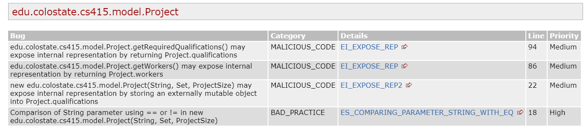

# P3 Static Analysis

## PMD Before Screenshot(s)

## PMD After Screenshot

### Fixed PMD issues
The issues we chose to address from the PMD Static Analysis were the parentheses issues
identified in the Company and Worker classes. The useless parantheses were not affecting 
functiionality, but made the code harder to read. The reason that we did not address the 
issues of too many static imports and unused formal parameter were because they came from
the base code and we did not feel it was appropriate to modify.
## Spotbugs Before Screenshots

## Spotbugs After Screenshots

